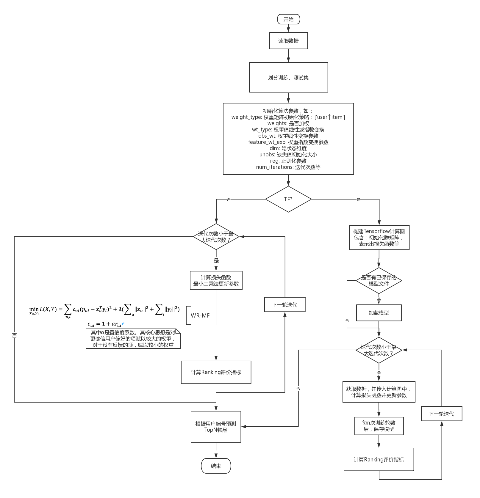

## 整体流程

## 数据加载

根据给出的路径读取数据，构建数据集

## 拆分数据集

使用简单交叉验证，首先划分出训练集和测试集，然后再将训练集分为训练数据和验证数据。

## 模型训练

## 模型保存与加载

训练前，判断是否存在保存的模型文件，若存在，则加载模型继续训练。训练时，每训练指定轮数，将模型参数保存到指定路径。

## 模型测试或评估

计算Ranking类型推荐算法的指标，包括：MAP、NDCG、召回率、精确率、F1值